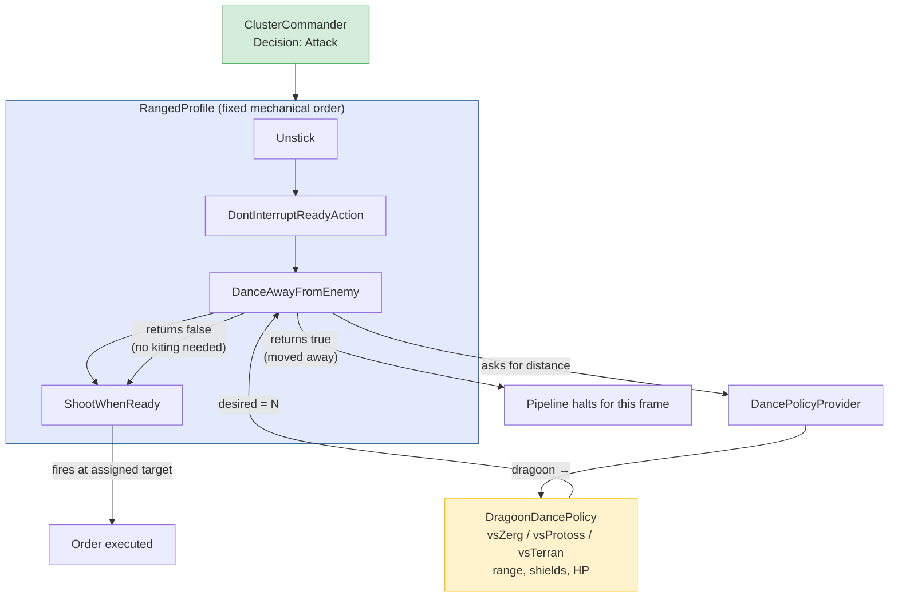

# Track 2: Combat System — Migrating from Manager Chains to Dynamic Clusters

> Priority: **AFTER PRODUCTION** (complex micro behaviors make isolated verification harder).
> Sources: `/sc-ai/Stardust/src/General/**`, `/sc-ai/Stardust/src/Units/**`;
> Atlantis: `src/atlantis/combat/**`.

## Current State Diagnosis (Atlantis)

### Topology

- Pipeline: `FramePipeline` → `CombatCommander` → (`MissionCommander`, `SquadsCommander`) → `ActWithSquadsCommander` → per squad `ASquadCommander` → **for every unit**: `new CombatUnitManager(unit).invokeFrom(this)`.
- Squads: `Alpha` (main army), `Bravo`, `Delta` (air/detectors), `Omega`, `X` (Dark Templar) — base class `Squad` (409 lines) holding leader, mission, cohesion, targeting.
- Managers: `CombatUnitManager` → race → `ProtossCombatManagerTopPriority` (**37 Managers in a single sequential list**), `MediumPriority`, `LowPriority`. Each Manager checks `applies()` and `handle()`; the first non-null action breaks the chain.
- Per-unit micro: `atlantis/protoss/{dragoon,zealot,dt,ht,reaver,arbiter,corsair}`, `atlantis/terran/{marine,repair,chokeblockers}`.
- Surrounding subsystems: `combat/eval`, `combat/targeting` (7 targeting classes), `combat/retreating`, `combat/running`, `combat/advance` (focus points), `combat/state`.

### Root Causes of Brittle Behavior

1. **Ordering Equals Implicit Semantics**: 37 sequential Managers, each able to intercept execution. Changing their array index alters bot behavior globally through undocumented dependencies.
2. **Three-Valued `Decision` Anti-Pattern** (`TRUE`/`ALLOWED`/`INDIFFERENT`/`FORBIDDEN`/`FALSE`): Creates ambiguous control flow alongside standard boolean returns.
3. **Decisions Made at Unit Level Without Group Cohesion**: Retreat/attack decisions are made by individual units independently. Cohesion is patched reactively (`SquadCohesion`, `ProtossForceCluster`).
4. **State Fragmentation**: State is scattered across `UnitState`, `Squad`, missions, focus points, and volatile caches.

---

## Target Model (Stardust)

### Hierarchy

```
Strategist (every frame)
  └─ Plays (MainArmyPlay, DefensivePlay, Scouting, SpecialTeams...) [Set]
       └─ Squads (AttackBaseSquad, DefendBaseSquad, WorkerDefenseSquad...)
            └─ UnitClusters (dynamic spatial groups)
                 └─ Units (tactical intent from cluster, kinematic execution per unit)
```

- **Play**: Strategic sub-goal holding transition lifecycle (`transitionTo`, `complete`, `disband`, `mineralReservations`, `productionGoals`). Finished Plays hand over units cleanly.
- **Squad**: Assignment to base/wall/choke target + `targetPosition`.
- **UnitCluster**: Core spatial engine. Formed automatically when a unit is too far from existing vanguards (`ADD_THRESHOLD = 480`). Clusters merge when close (`COMBINE_THRESHOLD = 480`, factoring in ball/line radii) and drop trailing outliers (`REMOVE_THRESHOLD = 600`). Recomputed continuously each frame.
- **Cluster Consensus State**: Explicit `Activity` (`Moving`, `Attacking`, `Regrouping`) × `SubActivity` (`ContainStaticDefense`, `ContainChoke`, `StandGround`, `Flee`, `AttackBlockingArmy`). Selected by combat simulation (FAP): `runCombatSim` buffers results (`recentSimResults`, `recentRegroupSimResults`) and requires stability (`consecutiveSimResults`) before altering state.
- **Group Formations**: `Ball` or `Arc` (pivot + desired distance) coordinating physical geometry before and during engagements.
- **Tactics**: `Attack`, `Regroup`, `Flee`, `HoldChoke`, `ContainStatic`, `StandGround`, `Move` — a compact, closed set of tactical routines replacing 37 ad-hoc Managers.
- **Squad Specialists**: Observers (detectors), Arbiters, and static Photon Cannons are managed at squad level (`Squad::executeDetectors/executeArbiters`), keeping them decoupled from general combat cluster decisions.
- **Coordinated Targeting**: `UnitCluster::selectTargets` computes optimal unit-target pairings at the cluster level. Units do not independently run competing target searches.
- **Lightweight Kinematic Layer**: `MyUnitImpl::attackUnit`, `move`, `unstick`, `simulatePosition`. Per-unit classes customize *how* an order executes, never *what* to do.

### Eliminating Global "Missions"

Stardust does not use global `Mission` states (`DEFEND`/`ATTACK`). Responsibilities are naturally distributed: Play (strategy) → Squad (mission target & anchor) → Cluster (tactical activity).

---

## Authority Separation: Commander vs. Manager

Mapping cleanly to Atlantis's existing naming conventions:

- **Commander** = Decisions for the group: *what* (`Attack`/`Regroup`) and *how as a formation* (Arc formation vs. open micro). Single unified decision point.
- **Manager / Executor** = Pure order execution for an individual unit. No authority to question whether to attack — only how to execute the assigned order effectively.
- In legacy Atlantis, Commanders were mere iterators, delegating actual decisions to Manager chains. Authority shifts from Manager chains up to Cluster Commanders.

### Tactical Routine Template (Replacing Chains)

Every tactic is a self-contained function with guards followed by execution:

```
attack(unitsAndTargets):
    if (unit.stuck)     -> unstick, continue    // mechanical guard
    if (!unit.isReady)  -> continue             // do not interrupt ongoing attack animations
    if (unit.hasTarget) -> attackUnit(target)   // individual target from cluster selectTargets
    else                -> moveTo(targetPosition)
```

Mechanical guards do not compete for authority; they are explicit preconditions.

### Capabilities-Based Exception Handling

Rather than hardcoded conditionals (e.g., checking if a unit is a Photon Cannon in retreat loops):

- Actions declare required capabilities: `Retreat.applicable(unit)` requires `unit.canMove()` — static defense naturally drops out without branch statements.
- Specialized roles: Detectors and Arbiters run on distinct command streams, not embedded inside combat army loops.

### Role of bwgame (Precision Engine)

Stardust embeds a complete SC:BW engine fork (`bwgame`), enabling deterministic future state simulation, exact velocities, and real cooldowns. For Java 1.8, FAP (`jfap`) plus spatial position forecasting provides the necessary performance without requiring full C++ engine emulation.

---

### Layered Micro Execution: Actions and Unit Profiles (Java 1.8)

Kinematic nuances (kiting melee attackers, cooldown-aware stutter-stepping, unit spacing) are **modes of execution**, not distinct strategic decisions. The cluster commands `Attack`; the unit executor manages micro-timing:

- **`CombatOrder`**: Declares required capabilities (`requires()`), acting as a clean command object.
- **`UnitOrderExecutors`**: Encapsulates common mechanical guards once (`applicable`, `isStuck → unstick`, `!isReady → skip`) and delegates to the appropriate unit profile executor.
- **Profile Executors**: Manage profile-specific micro without modifying the high-level tactical intent.

### Behavior Pipeline Composition (SRP & OCP)

Instead of monolithic 300-line executors filled with conditionals, micro is composed via small, focused behaviors:

- **`MicroBehavior`**: Focused interface for single kinematic concerns (`Unstick`, `DontInterruptReadyAction`, `AvoidSpellsAndMines`, `DanceAwayFromEnemy`, `ShootWhenReady`). Returns `true` to halt the micro pipeline for the current frame without altering the tactical order.
- **Unit Profiles** (`RangedProfile`, `MeleeProfile`): Short, explicit, immutable lists (5–8 elements) defining physical execution sequence.
- **Cross-Profile Reusability**: `DanceAwayFromEnemy` is shared across ranged (Dragoon vs. Zergling) and melee (Zealot vs. Zergling), parameterized by unit policies.

### Per-Unit Dance Policies

Real kiting distance depends on multiple state dimensions (weapon upgrade range, regenerating Protoss shields vs. permanent Terran damage, health percentages, enemy unit types).

- **Generic Behavior** (`DanceAwayFromEnemy`): Interrogates a `DancePolicy` for desired separation distances.
- **`DancePolicy` Implementations** (`DragoonDancePolicy`, `ZealotDancePolicy`, `MarineDancePolicy`): Encapsulate multi-factor decision logic cleanly.
- **Registry & Defaults**: `Map<AUnitType, DancePolicy>` with fallback to physical speed/cooldown models.

#### Attack Phase Is a Derivation, Not a Decision

The attack phase ("shoot now" vs. "step back until cooldown resets") does not exist as a decision point anywhere in the command hierarchy. It **falls out deterministically** from three inputs:

1. **The Order** (`Attack`/`Retreat`) — issued once by the `ClusterCommander`.
2. **The Unit Profile** (`RangedProfile`/`MeleeProfile`) — determined by unit type, never by list ordering.
3. **The Unit State** (weapon cooldown, distance to enemy, shields/HP) — read inside the `DancePolicy`.

Manager-style ordering only becomes necessary when **two behaviors compete for the same movement command in the same frame**. In this architecture competition is structurally impossible: the profile pipeline halts at the *first behavior that actually issues a command*, and the pipeline order is mechanics (survival > kiting > firing), not policy.

**Design smell to watch for**: if you ever feel the urge to *reorder* behaviors in a profile to fix behavior, that behavior is *deciding* rather than *executing* — move that decision up into the `DancePolicy` or the `ClusterCommander`.

#### Example: Dragoon kiting a Zealot (Java 1.8)

```java
/** Generic reflex. Knows nothing about unit types. Never changes intent. */
public class DanceAwayFromEnemy implements MicroBehavior {

    private final DancePolicyProvider policies;

    public DanceAwayFromEnemy(DancePolicyProvider policies) {
        this.policies = policies;
    }

    @Override
    public boolean act(AUnit unit, CombatOrder order, ClusterContext ctx) {
        if (!order.isAttack()) return false;          // only kites within Attack intent
        AUnit threat = ctx.mostDangerousAttackerOf(unit);
        if (threat == null) return false;

        DancePolicy policy = policies.forUnit(unit);  // DragoonDancePolicy for a dragoon
        int desired = policy.danceAwayDistance(unit, threat);
        if (desired < 0) return false;                // this matchup: stand and fight

        boolean enemyInRangeBeforeWeCanFire =
                unit.distTo(threat) < desired && unit.cooldownRemaining() > 0;
        if (!enemyInRangeBeforeWeCanFire) return false;

        unit.moveAwayFrom(threat, desired);           // the ONLY action this behavior may take
        return true;                                  // halt pipeline; ShootWhenReady will not run
    }
}

/** Tuned per unit. This is where "vsZealot / vsZergling" tuning lives. */
public class DragoonDancePolicy implements DancePolicy {

    @Override
    public int danceAwayDistance(AUnit dragoon, AUnit enemy) {
        int myRange = dragoon.groundWeaponRange();    // 4 tiles, 6 with Singularity Charge

        switch (enemy.type().getRace()) {
            case Zerg:                                // fast melee swarm: full kite
                return myRange + (dragoon.shields() > 0 ? 0 : 32);
            case Protoss:                             // mirror: trade willingly
                return dragoon.shields() > 30 ? myRange : myRange + 32;
            case Terran:                              // vultures/mines: conservative spacing
                return myRange + 48;
            default:
                return myRange;
        }
    }
}
```

Frame-by-frame outcome for the **same** dragoon under the **same** `Attack` order — no manager, no ordering, no phase switch:

| Frame | Cooldown | Enemy dist | Policy result | Pipeline outcome |
|---|---|---|---|---|
| 100 | 0 | 5 tiles | in range | `ShootWhenReady` → fires |
| 101–115 | > 0 | closing | kiting distance | `DanceAway` → steps back |
| 116 | 0 | 6 tiles | in range | `ShootWhenReady` → fires again |

#### Flow Diagram (Mermaid)



Key structural property visible in the diagram: `DanceAwayFromEnemy` and `ShootWhenReady` **never negotiate**. The policy output (`desired = N`) only decides whether the generic behavior fires this frame; the *intent* (`Attack`) set by the commander is immutable as it flows down.

#### OCP Compliance Analysis: Where We Open, Where We Close, and Why

The question "does this design follow Open/Closed Principle?" does not have a single yes/no answer — it depends on **which axis of extension** we consider. Three axes exist, with very different costs:

**Axis 1 — New unit type / new race: OCP strictly satisfied.**
Adding a Hydralist or a Zerg race means writing a new `DancePolicy` implementation and registering it in the `Map<UnitType, DancePolicy>`. Zero changes to `DanceAwayFromEnemy`, profiles, or commanders. This is textbook OCP — and it covers ~95% of day-to-day development (matchup tuning is the routine work).

**Axis 2 — New matchup inside a policy: deliberately closed (OCP consciously violated).**
`DragoonDancePolicy` switches on the enemy race — a new matchup requires editing that method. But the violation is **confined to one small class with one responsibility**. The formally "purer" alternative (separate classes per matchup: `DragoonVsZealotPolicy`, `DragoonVsZerglingPolicy`, ...) yields dozens of near-empty files where most matchups differ by a single integer. Here we choose readability over orthodoxy on purpose.

**Axis 3 — New micro concern (new behavior): OCP partially violated — the real cost.**
`RangedProfile.BEHAVIORS` is a modified list. A new behavior (e.g. `AvoidPsiStorm`) requires editing the profile class. This does break OCP formally — but note exactly *what* the modification touches: adding one line to an explicit list, **without modifying any existing behavior or the commander**. This is a much weaker form of violation than editing conditionals inside a decision method:

- Editing the list cannot corrupt existing behaviors' logic — interactions surface only through ordering, which is visible in one place and testable.
- In the legacy manager chain, adding a process meant editing a shared 37-element structure where repositioning anything changed behavior for everything below, invisibly.

**Deliberate rejection of the "pure" alternative:** axis 3 *could* be formally closed (external behavior registry, per-profile configuration). We reject this intentionally: ordering would become implicit configuration rather than an explicit design decision, someone could insert a behavior "somewhere" without owning its position in the survival sequence, and we would return to a world where ordering is an accident of configuration. For a pipeline whose ordering is survival mechanics (unstick before firing, always), a closed list is the better engineering choice.

**Why "slightly broken OCP + better readability" is a sound trade, not a rationalization:**

OCP serves two practical goals: (a) extend without corrupting working code, (b) understand the system without reading all of it. A closed profile list delivers (b) fully and (a) ~90%; the missing 10% pays for itself in debugging, because in CherryVis traces and unit tests you *see* the full sequence a unit walked through, instead of reconstructing it from buried inter-class dependencies.

**Decision rule for the future:** violate OCP when (and only when) all three hold:

1. The modification is confined to one class with a single responsibility.
2. It is an explicit list/configuration entry, not conditional logic.
3. A test exists that catches ordering-interaction regressions.

All three hold for behavior profiles. If any breaks, that is the signal to move that extension point to composition or a registry.

---

### Combat Simulation: FAP for Frame Gating, OpenBW for Deep Checks

- **Frame-by-Frame Gating**: FAP (`jfap`) — lightweight and fast.
- **Strategic Transitions**: Deep headless OpenBW simulation for major choices (chokepoint breaches, base assaults), run infrequently and buffered across `consecutiveSimResults`.

---

## Migration Steps for Java 1.8

1. **Domain Structures**: Implement `Cluster` (units, center, vanguard, activity, subActivity, radii) and `ClusterActivity` enums.
2. **Spatial Clustering Engine**: Port `Squad::updateClusters` proximity logic (480/480/600 thresholds).
3. **Simulation Gating**: Integrate `jfap` with buffered results (`recentSimResults` + `consecutiveSimResults`).
4. **Tactical Routines**: Implement `Attack`, `Regroup`, `Flee`, `HoldChoke`, `ContainStatic`, `StandGround`.
5. **Formations & Targeting**: Port `Ball`/`Arc` formations and cluster-level `selectTargets`.
6. **Specialist Separation**: Move Observers, Arbiters, and static Cannons to squad-level command loops.
7. **Phase-Out**: Deprecate legacy manager chains (`combat/micro/**`), static squads, and `Decision`.
8. **Unit Micro Port**: Port unit-specific micro routines into profile behaviors.

## Success Metrics & Validation

- **Determinism**: Identical inputs yield identical cluster decisions.
- **Hysteresis Stability**: Zero attack/regroup oscillations under 6 frames of simulation consensus.
- **Codebase Simplification**: Reduction of combat architecture classes from ~60 to ~20.
- **Winrate / Unit Trades**: Measured in equal-supply A/B tournament benchmarks.
