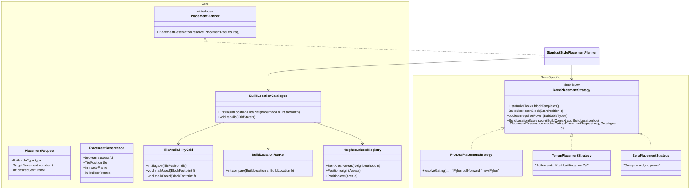

# Track 3: Building Placement — Reverse Engineering Stardust's Algorithm

> **Implementation status (2026-10-08): S1-S6 have a cut in `atlantis.placement`**
> (`core/` pure, `engine/` the only game reader, `race/` the race extension point,
> `policy/` the fortification policy, `blocks/` the template table). The legacy
> `APositionFinder` is still the default; set ENV `PLACEMENT=catalogue` to use the
> new planner. What each stage delivered, and what it deliberately left out, is
> recorded inline at the end of §5.4 - read that before continuing.
>
> Source of truth: `/sc-ai/Stardust/src/Builder/BuildingPlacement.{h,cpp}` (~1,270 lines),
> `Builder/Block.{h,cpp}`, `Builder/Blocks/**`, `Builder/ForgeGatewayWall.h`,
> consumed by `Producer/Producer.cpp` (`reserveBuildPositions`, `choosePylonBuildLocation`).
>
> Purpose: Document the complete placement pipeline so it can be ported to Atlantis Java 1.8
> as a clean `PlacementPlanner` implementation behind the existing
> `PlacementPlanner` interface described in `01_PRODUCTION.md`.

---

## 1. Conceptual Model (What Makes This Approach Work)

Stardust does **not** search for a single tile when a building is requested. Instead it
precomputes, once per map-state change, a **catalogue of all valid building locations on the
whole map**, grouped by base "neighbourhood" and by building width. Placement then becomes a
cheap lookup + scoring operation against that catalogue.

Three ideas are load-bearing:

1. **Blocks (prefab templates).** Instead of evaluating 1×1 tiles, Stardust stamps
   hand-designed rectangular layouts ("Blocks") across the map. A Block already knows where its
   Pylon goes, which tiles are small (2×2), medium (3×2), large (4×3), and where cannons go.
   This encodes human Protoss base-design knowledge (gateway spacing, tech building adjacency)
   for free.
2. **Tile availability bitmap.** A single `uint` per map tile tracks: unbuildable/blocked (=1),
   blocked-adjacent (=2 from buildable side), used-by-block (=4), block-border (=8). Blocks are
   only stamped where every tile they occupy passes `checkTile`.
3. **Lazy, event-driven recomputation.** The catalogue is rebuilt only when `updateRequired`
   flips (building queued/cancelled/created/destroyed, base taken/lost, choke changed, enemy
   rush detected, hidden base discovered). Between rebuilds, only `framesUntilPowered` is
   refreshed per frame. This is why Stardust can afford a whole-map scan.

---

## 2. Full Algorithm — Step-by-Step

### Phase 0 — Initialization (once per game / per map state reset)

**Step 0.1 `initializeTileAvailability()`**
- Allocate `tileAvailability[mapWidth * mapHeight]` (array of `unsigned int`).
- For every tile: if `!Map::isWalkable || !BWAPI::isBuildable` → mark `1` and mark its 8
  neighbours with `|= 2` (so a block cannot sit flush against impassable/unbuildable terrain;
  a one-tile margin is always enforced).
- For every base on the map: force the Nexus footprint (5×4) to `1` (unbuildable) and its
  border ring to `2`, so no block ever overlaps a resource depot.
- For every geyser whose tile is at/right of the base tile: mark a 3×2 region between the
  geyser and the Nexus as unbuildable (`1`) to avoid blocking gas collection paths.

**Step 0.2 `updateNeighbourhoods()`**
- Build the three `Neighbourhood` area sets:
  - `MainBase` — `Map::getMyMainAreas()` plus map-specific overrides.
  - `AllMyBases` — main areas + every owned non-island base with a depot.
  - `HiddenBase` — hidden base area + nearby areas connected within 640 px (in case the base
    area itself offers no build locations).
- For each area record `areaOrigins[area]` (mineral line center) and `areaExits[area]` (main
  choke center, or the area origin for hidden base).

### Phase 1 — Start Block (the anchor layout)

**Step 1.1 `findStartBlock(base)`**
- Try a prioritized list of start-block templates in order:
  `StartNormalLeft → StartNormalRight → StartCompactLeft → StartCompactRight →
   StartCompactLeftHorizontal → StartCompactRightVertical → StartBottomLeftHorizontal →
   StartTopLeftHorizontal → StartBottomHorizontal → StartAboveAndBelowLeft`.
- A template is accepted only if `tryCreate(naturalExpansionTile, tileAvailability)` succeeds —
  i.e. the whole layout fits with no conflicting tiles.
- On success: register the block (`startBlock` for main, `baseToStartBlock[base]` otherwise),
  pick a defensive cannon from its `small` locations (first one that isn't the power pylon),
  and call `addBaseStaticDefense` (this also determines `workerDefenseCannons` — see Phase 3).
- If no template fits → log a warning and continue (degraded but non-fatal).

The start block provides approximately: 2 gateways, 2–4 tech buildings, 3–4 cannons.

### Phase 2 — Base Static Defense

**Step 2.1 `findBaseStaticDefenses()`** (per base, main handled via start block in Step 1.1)
- `initializeBaseDefenseAnalysis(base)` computes both choke ends, and candidate tiles that:
  are buildable, are close enough to the mineral line, and provide coverage between the choke
  and the mineral line.
- Candidate tiles are scored, the best ones become `workerDefenseCannons`.

For the main base, positions from the start block are **re-scored and re-ordered**:
- Score vs mineral line: `dist(mineralLine) * 4 + dist(geyser)`.
- Plus, whenever a main choke exists: `(dist(choke, pos) − dist(choke, mineralLine)) * 2`.
- Separately, find the cannon that best defends the start block (closest to power pylon, with
  a choke-distance correction).
- Final order: (1) best mineral-line defender, (2) best start-block defender, (3) rest by score.

### Phase 3 — Full-Map Block Stamping

**Step 3.1 `findBlocks()`**
- Try a fixed, prioritized list of 24 rectangular templates (largest first):
  `Block18x6, Block16x8, Block17x6, Block14x6, Block12x8, Block16x5, Block18x3, Block13x6,
   Block10x6, Block8x8, Block14x3, Block12x5, Block10x3, Block8x5, Block4x8, Block6x3,
   Block4x5, Block8x2, Block5x4, Block5x2, Block4x4, Block4x2, Block2x4, Block2x2`.
- For each template, scan **outward from the map center in four quadrants** (top-left,
  top-right, bottom-left, bottom-right), i.e. the scan terminates at the map midpoint in each
  direction — natively biasing stamps toward the map interior rather than corners.
- At each candidate origin call `blockType->tryCreate(tile, tileAvailability)`; on success the
  block reserves its tiles via `Block::place`.

**Step 3.2 `Block::place()` — what "fits" means**
- The four corners of the block plus every tile inside must pass `checkTile`.
- `checkTile` rejects when: out of map bounds; `tileAvailability > 0` (already blocked/used);
  or the tile is on a disallowed map edge (top/left/right per `allowTopEdge/allowLeftEdge/
  allowRightEdge/allowCorner` overrides the template may set).
- On success, mark the block's interior tiles `|= 4` ("used") and its surrounding border ring
  `|= 8` ("border"), so the next template cannot butt directly against it.

**Step 3.3 `Block::placeLocations()` + `Block::removeUsed()`**
- `placeLocations()` (template-specific) fills the block's `small` (2×2), `medium` (3×2),
  `large` (4×3) location lists from the raw rectangle geometry, skipping the power-pylon tile.
- `removeUsed()` prunes any location whose footprint overlaps non-walkable terrain (e.g. a
  location that happens to land partly on the block's own reserved/unbuildable tile).

### Phase 4 — Main-Choke Cannon Placement (Protoss-specific defense)

**Step 4.1 `findMainChokeCannonPlacement()`**
- Select main-base blocks; find the closest `small` location that is powered by a block pylon
  and lies between 3 and 8 tiles (`96..256 px`) from the main choke center.
- If none is found, scan the whole main base for a tile that:
  is inside the main, is in detection range of the choke center, is powered by some block, and
  is bordered by unbuildable/reserved tiles on at most one side (leaving a walkable escape).
- Record the chosen block/tile as `chokeCannonBlock` / `chokeCannonPlacement`, used later for
  DT-detection Pylon priority (see Phase 6 scoring).

### Phase 5 — Catalogue Construction

**Step 5.1 `updateAvailableBuildLocations()`**
- Gather pending Pylons (`Builder::pendingBuildingsOfType(Pylon)`).
- For each block:
  - Compute `poweredAfter(tile, kind, pendingPylons)`: `0` if already powered; otherwise the
    earliest completion frame among pending pylons that `UnitUtil::Powers` that tile; `-1` if
    no pylon can ever power it. Separate medium (3×2) and large (4×3) locations into
    `powered` and `unpowered` buckets by this value.
  - Skip the block entirely if `small` is empty and both powered buckets are empty (full block).
  - For each `Neighbourhood` the block's center area belongs to, emit `BuildLocation` records
    into `result[neighbourhood][tileWidth]`:
    - Pylons → slot `[2]`; each pylon carries `powersMedium`/`powersLarge` lists (the concrete
      medium/large locations it would unlock, each annotated with builder frames and
      `distanceToExit`).
    - Powered medium → slot `[3]` (`isTech = true`).
    - Powered large → slot `[4]`.
- `BuildLocation` fields: `location`, `builderFrames` (approx. worker travel), `framesUntilPowered`,
  `distanceToExit`, `isTech`, `powersMedium`, `powersLarge`.
- Sort each of the 9 lists (`neighbourhood × width`) with `BuildLocationCmp`.

**Step 5.2 `distanceToExit(neighbourhood, exit, tile, type)`**
- Ground distance (Dragoon pathing, nearest-BWEM-area option) from tile center to exit.
- Main-base large buildings within 320 px of the exit get their distance **inverted**:
  `dist = 320 + (320 − dist)`. Rationale: keep the choke clear for defense; a large building
  near the main exit is *penalized*, not rewarded.

### Phase 6 — Ranking: `BuildLocationCmp` (the placement preference order)

Applied as a strict lexicographic ordering for every requested (building type, neighbourhood):

1. **Start-block power pylon** always first.
2. **DT-detection choke pylon** next, but only if enemy is Protoss AND `!buildAwayFromExit`.
3. **Main geyser/refinery location** next.
4. **Earliest `framesUntilPowered`** — prefer already-powered locations.
5. **`hasExit == false` before `hasExit == true` for medium locations** — leaves exit-capable
   slots free for buildings that need one (e.g. Robotics Facility).
6. **Original (non-`converted`) locations before converted ones.**
7. **Distance score**, weighted:
   - `(builderFrames * 2 − distanceToExit)` when `isTech || buildAwayFromExit` (tech buildings
     and rush-mode builds prefer being *further* from the choke),
   - `(builderFrames * 2 + distanceToExit)` otherwise (normal buildings prefer being *closer*
     to the exit, i.e. toward the map).

### Phase 7 — Per-Frame Maintenance

**Step 7.1 `update()` per frame**
- Recompute `buildAwayFromExit = isEnemyRushing() || !Units::enemyAtBase(main).empty()`; if it
  flipped, set `updateRequired = true`.
- Discover hidden base once; if found, `updateRequired = true`.
- If `updateRequired`: re-run `updateNeighbourhoods()` + `updateAvailableBuildLocations()`.
- Else: run only `updateFramesUntilPowered()` — recompute each location's `framesUntilPowered`
  from current pending pylons and re-sort affected lists.
- Always: `updateAvailableGeysers()` (owned bases with a completed/near-complete depot, geyser
  not yet refined and not already pending here).

**Step 7.2 Event hooks that invalidate the catalogue**
- `onBuildingQueued` → for every block `tilesReserved(tile, size)` → `updateRequired`.
- `onBuildingCancelled` → `tilesFreed` (re-places prior locations, re-applies permanent
  reservations) → `updateRequired`.
- `onUnitCreate(building)` → `tilesUsed`; creation of a depot (ours) also invalidates.
- `onUnitDestroy(building)` → `tilesFreed`; destruction of our depot also invalidates.
- `onMainChokeChanged` → `findMainChokeCannonPlacement()` + `updateRequired`.

---

## 3. How the Producer Consumes the Catalogue

Placement is not decided by the catalogue alone — the Producer (`handleGoal`/`reserveBuildPositions`)
applies the economic/time dimension on top:

1. **Pylon request** → `choosePylonBuildLocation(pylon, tentative, requiredWidth)`:
   - Iterate `buildLocations[neighbourhood][2]` (Pylons) in ranked order.
   - Hard filter: with `requiredWidth == 3` require `powersMedium` non-empty; with `== 4`
     require `powersLarge` non-empty.
   - Score each candidate by *how many still-missing* medium/large slots it powers, aiming to
     keep ≥2 medium and ≥2 large powered at all times; take the best (early-exit on score 0).
   - If no candidate satisfies the hard requirement, fall back to the first ranked Pylon.
   - `tentative == false` commits: assign `buildLocation` and erase it from the list.

2. **Psi-requiring building request** → look at `buildLocations[neighbourhood][tileWidth]`:
   - Walk the ranked list; skip locations that `hasExit == true` *only* when the requested
     type is a Robotics Facility (it needs the exit).
   - If the top location is already powered at/ before the item's `startFrame`: take it.
     Special case — a Stargate will look ahead while `framesUntilPowered` is equal, choosing a
     location with lower `builderFrames`.
   - If not yet powered: find the earliest committed Pylon still lacking a tile and try to
     **pull it earlier** in time (`shiftOne`), bounded by when minerals allow; use that pylon's
     completion as availability, else queue a **new** Pylon (only if it can beat the current
     best by the 250-frame builder-travel buffer).

3. **`reserveBuildPositions(items, commit)`** runs once tentatively (`commit=false`, to compute
   the earliest possible schedule for prerequisites) and once for real (`commit=true`), which
   erases consumed locations from `buildLocations` so the same tile is never double-booked.

---

## 4. Port Plan for Atlantis (Java 1.8) — Clean Rewrite, No Legacy Reuse

**Decision: burn the bridges.** The existing Atlantis `APositionFinder` is **not** wrapped,
**not** adapted, and **not** kept as a temporary shim. Placement is rewritten from scratch in
the new production layer. The legacy `APositionFinder`, `RefreshConstructionPosition` and the
`constructions/builders/position` recovery classes are treated as dead code and deleted in the
same cut-over as the queue. There is no incremental "wrap the old finder" milestone — the new
planner is the only implementation, and the old path is removed once the Producer cut-over is
green.

### 4.1 Race-agnostic core vs. race-specific strategies

Stardust's placement is Protoss-shaped (Psi power, Pylon gating, cannon chokes). The rewrite
splits this explicitly into a **race-neutral core** and **race plug-in strategies**, so no
Protoss assumption leaks into shared code.

### 4.2 Class breakdown (all new code, single responsibility)

**Race-agnostic core (`atlantis.placement.core`)**

| Class | Responsibility |
|---|---|
| `PlacementPlanner` (interface) | The contract consumed by `ProductionScheduler` (see `01_PRODUCTION.md`). |
| `PlacementRequest` / `PlacementReservation` | Immutable in/out value objects. |
| `StardustStylePlacementPlanner` | Orchestrator: builds/refreshes catalogue, delegates gating to the race strategy, returns a reservation. Owns all state (no statics). |
| `TileAvailabilityGrid` | Per-tile flags: `BLOCKED=1`, `ADJACENT=2`, `USED=4`, `BORDER=8`; base/geyser protection rules applied via hooks, not hardcoded. |
| `BuildBlock` (abstract) + concrete `Blocks/*` | Prefab layout: `tryCreate`, `place`, `placeLocations`, `removeUsed`, `width`, `height`. |
| `BuildLocation` (immutable value) | Tile, builderFrames, framesUntilAvailable, distanceToExit, isTech, plus strategy-opaque payload for race extras. |
| `BuildLocationCatalogue` | Emits + caches the `[neighbourhood][tileWidth]` lists; rebuild on invalidation. |
| `BuildLocationRanker` | Configurable comparator; ordering rules come from the strategy, not hardcoded. |
| `NeighbourhoodRegistry` | Named area sets + origins + exits (race strategy may define extra neighbourhood names). |
| `PlacementInvalidationListener` | Maps Builder/Units/base events to `invalidate()`. |

**Race-specific strategies (`atlantis.placement.race`)**

| Class | Responsibility |
|---|---|
| `RacePlacementStrategy` (interface) | The single extension point for racial differences. |
| `ProtossPlacementStrategy` | Psi gating, Pylon scoring/pull-forward/new-pylon logic, start-block cannon selection, choke-cannon + DT-detection priority, Protoss block templates. |
| `TerranPlacementStrategy` | Addon slots, lifted/landed building reservation, wall-off priority, no Psi. |
| `ZergPlacementStrategy` | Creep-based availability, no power, minimal block templates. |

**Deletion list (same cut-over as the Producer rewrite):**
`APositionFinder`, `RefreshConstructionPosition`, all `constructions/builders/position*`
classes, and the placement-related caches keyed off the legacy `Construction` object.

### 4.3 What lives in the core vs. what lives in the strategy

| Concern | Core | Strategy |
|---|---|---|
| Tile gating bitmap construction | Yes | Provides base/geyser protection hooks |
| Whole-map block stamping loop | Yes | Supplies the template list |
| `[neighbourhood][width]` catalogue | Yes | Supplies neighbourhood definitions |
| Ranking *mechanism* (comparator plumbing) | Yes | Supplies the weighted score / ordering rules |
| `framesUntilAvailable` computation | Yes | Interprets it ("powered" for Protoss = 0 when Psi satisfied) |
| Gating resolution ("can this be placed now?") | Delegates | Protoss: Pylon pull-forward / new Pylon; Terran: Addon dependency; Zerg: creep spread |
| Start-block selection | Delegates | Race-specific template list |

This keeps the core genuinely reusable: adding Terran later is a new `RacePlacementStrategy`
implementation plus Terran block templates — **zero edits** to the core (OCP on the race axis).

### 4.4 Implementation staging (rewrite, not wrap)

1. **Core skeleton:** `PlacementPlanner` interface + `PlacementRequest`/`PlacementReservation` +
   `TileAvailabilityGrid` + `BuildLocation` + `BuildLocationCatalogue` + `NeighbourhoodRegistry`.
   Unit-testable with a synthetic tile array (no BWAPI).
2. **Protoss strategy, blocks:** `BuildBlock` + start-block variants + the 6 largest normal
   blocks. Delivers the bulk of practical gains.
3. **Protoss strategy, gating:** Pylon scoring, pull-forward, new-Pylon creation, choke-cannon
   and DT-detection priority; full 24-template list.
4. **Cut-over + deletion:** swap `ProductionScheduler` to the new planner, flip the feature flag,
   then delete `APositionFinder` and the legacy position-recovery classes. No coexistence period
   beyond the flag flip.

### 4.5 Terran/Zerg differences considered up front (design only, not implemented)

Captured now so the core contract does not have to change later:

- **No Psi gating (Terran/Zerg):** `framesUntilAvailable` semantics differ. For Protoss it is
  dominated by Pylon timing; for Terran it is dominated by *Addon availability* (a Barracks
  needing a Tech Lab/Reactor) and *lift/land* mechanics; for Zerg by *creep coverage*. The core
  only exposes `framesUntilAvailable` + a strategy hook to recompute it — no Psi concept leaks.
- **Addon/dependency slots (Terran):** the block templates must reserve a paired footprint for
  the Addon. The `BuildBlock` contract therefore carries a list of `BuildLocation`s of arbitrary
  size (not just width 2/3/4), so Addon slots are first-class, not a special case.
- **Lifted buildings (Terran):** a placed building can be temporarily invalidated in place. The
  core must treat "currently occupied by a lifted building" as `USED` but not permanent — the
  grid needs a `SOFT_USED` state distinct from hard `USED`.
- **Creep (Zerg):** availability depends on terrain + creep growth over time, so
  `framesUntilAvailable` must be able to depend on a projected creep front, not just a static
  power check. The strategy hook signature already allows this (it receives the catalogue +
  request, and can consult arbitrary game state).
- **Wall-offs:** Protoss choke-cannon and Terran wall-off are both "choke-shaped" concerns but
  are computed differently; the core exposes choke geometry via `NeighbourhoodRegistry` (exits),
  while wall construction stays entirely in the strategy.

**Consequence for the contract:** the domain type is named `BuildableType` (not
`BWAPI::UnitType`-centric) and `BuildLocation` carries a strategy-opaque payload, so no
Protoss-specific field (e.g. `powersMedium`) is baked into core. Protoss Pylon powering is
represented in `ProtossPlacementStrategy` as a strategy payload attached to `BuildLocation`.

### 4.6 Risks / caveats to carry over

- **No legacy fallback.** Because we burn the bridges, the cut-over must be guarded by a feature
  flag and validated in CIG A/B before deleting the old code. There is no "fall back to
  `APositionFinder`" safety net — the net is the flag + pre-cut-over test coverage.
- **`framesUntilAvailable` is approximate** (Stardust has an explicit TODO here): times are
  estimated and a Pylon (or Addon) may itself shift later. Accept the same imprecision, but keep
  it isolated inside the race strategy so the core stays deterministic and unit-testable.
- **Whole-map stamping cost** is O(map area × template count) at init and on invalidation.
  Measure in profiles; cache per starting location if it ever becomes a bottleneck.

---

## 5. Legacy Atlantis Building/Project-Assembly Inventory — Treated as Suspect

**Starting position: everything Atlantis currently does around building placement, ordering,
and base fortification is presumed wrongly designed, redundant, or obsolete until proven
otherwise.** The existing code is not a baseline to preserve; it is a list of requirements to
re-derive from scratch. This section inventories it functionally (not class-by-class) so the
rewrite can decide, per capability, whether it becomes a core responsibility, a race strategy
responsibility, a later stage, or is dropped.

Concrete legacy surface observed under `src/atlantis/production/`:

- `constructions/**` — ~94 classes: `ConstructionRequests`, `Construction`, `RequestBuild`,
  `RequestCannonAt`, per-race build request helpers, `ConstructionsCommander` + recovery
  sub-commanders (`ConstructionStatusChanger`, `ConstructionThatLooksBugged`, `IdleBuildersFix`,
  …), and `constructions/builders/position*` (the tile-search path coupled to `APositionFinder`).
- `dynamic/protoss/ProtossSecureBasesCommander` + `dynamic/protoss/reinforce/**`
  (`ShouldSecureProtossBase`, `ProtossSecureBaseWithCannons`, `RequestCannonAt`) — the
  "secure a base with Photon Cannons" feature.
- `dynamic/expansion/**` (`ExpansionCommander`, per-race expansion commanders) — base expansion.
- `dynamic/**` generally — worker/supply/tech/army goal emitters interleaved with the queue.

### 5.1 Capability inventory (existing) → target home

| # | Capability (legacy) | Where it lives today | Target home in rewrite | Stage |
|---|---|---|---|---|
| C1 | Choose a valid tile for a generic building (no Psi, no choke semantics) | `APositionFinder` + `construction*` | Core: `BuildLocationCatalogue` + `BuildLocationRanker` | **S1** |
| C2 | Reserve/commit a tile so it can't be double-booked | `ConstructionRequests` / queue | Core: catalogue `tentative/commit` | **S1** |
| C3 | Prefab base layouts (gateway/tech adjacency) | none (ad-hoc) | Core `BuildBlock` + race block templates | **S2** |
| C4 | Start-block anchor for a base | none reliable | Race strategy: start-block templates | **S2** |
| C5 | Protoss Psi gating (tile powered / soon-powered / Pylon pull-forward) | scattered in `constructions` | Race: `ProtossPlacementStrategy` | **S3** |
| C6 | Probe travel-time estimate for a candidate tile (`builderFrames`) | partial, per-case | Core (compute) + Race (interpret) | **S2** |
| C7 | Distance-to-exit weighting (map-facing vs. choke-facing) | `APositionFinder` heuristics | Core via `NeighbourhoodRegistry` + ranker rules | **S3** |
| C8 | Executing the build with a chosen worker (issue `build` command, handle death/retry) | `ConstructionsCommander` + `builders/**` | Producer `OrderIssuer` / `BuildingOrderDirector` (see `01_PRODUCTION.md`) | **S1** |
| C9 | Choke geometry (main/natural chokes, exits) | `Map`/`Chokes` (keep) | Core `NeighbourhoodRegistry` | **S3** |
| C10 | Forge/Gateway choke wall construction | partial | Race: dedicated wall strategy (own document) | **S4** |
| C11 | Main-choke defensive cannon placement (DT detection) | none solid | Race: `ProtossPlacementStrategy` | **S4** |
| C12 | "Secure a base with cannons" policy (how many, where, when) | `ProtossSecureBasesCommander` + `reinforce/**` | **Future policy layer** — not placement | **S5** |
| C13 | Cannon count heuristics per matchup (mutas, zerg supply tiers, mineral thresholds) | `ShouldSecureProtossBase` | **Future policy layer** | **S5** |
| C14 | Base expansion decision (when to take a base) | `dynamic/expansion/**` | Producer goals + a future `ExpansionPlay` (see `02_COMBAT.md`) | **S5** |
| C15 | Cancel an in-progress/failed expansion | `ProtossCancelExpansionCommander` | Fall out of stateless recompute; no dedicated class | **S5** |
| C16 | Build-order-driven building requests | build orders → queue | `BuildOrderGoals` (see `01_PRODUCTION.md`) | **S1** |
| C17 | Dynamic building requests (supply, tech, army structures) | `dynamic/**` commanders | `DynamicGoals` contributors | **S2** |

### 5.2 Future / derived requirements (not yet in Atlantis, needed for parity)

| # | Requirement | Notes |
|---|---|---|
| F1 | Addon slots and dependencies (Terran) | Contract must allow arbitrary-width locations (see §4.5). |
| F2 | Lifted/landed buildings (Terran) | Grid needs `SOFT_USED` distinct from `USED`. |
| F3 | Creep-dependent availability (Zerg) | `framesUntilAvailable` must read a projected creep front. |
| F4 | Wall-off variants beyond Forge/Gateway | e.g. Pylon-wall, Terran supply-depot wall, Zerg no-wall. |
| F5 | Hidden/island base placement | `Neighbourhood.HiddenBase` already modelled; island handling TBD. |
| F6 | Re-expansion after losing a base | Falls out if expansion is goal-driven and placement is stateless. |
| F7 | Tournament-map-specific overrides (wall/choke choices) | Maps to Stardust's `Map::mapSpecificOverride()` hook. |

### 5.3 Critical boundary: placement ≠ policy

The most important reclassification: **`ProtossSecureBasesCommander` and its `reinforce/**`
helpers are NOT placement code.** They are a *policy* that says "this base should be fortified,
with N cannons, roughly here". That policy:

- belongs to the **strategy/Play layer**, expressed as ordinary `ProductionGoal`s
  (e.g. `Goal(Photon_Cannon, count=N, placement=Neighbourhood(base)|ExactTile(chokeSide))`),
- must **not** compute tiles itself — "roughly here" is expressed as a `TargetPlacement`
  constraint, and the `PlacementPlanner` resolves it to a real tile,
- must **not** carry its own mineral/supply thresholds (`A.minerals() >= 540`, zerg supply
  tiers, muta bonus). Those thresholds are goal-generation concerns and belong with the
  goal emitters, not in placement.

Consequently, the legacy `ShouldSecureProtossBase` heuristics are archived as *requirements
input for a future policy*, not ported into the planner.

### 5.4 Staged plan

Stages are strictly ordered; each is shippable and testable on its own.

- **S1 — Core placement + generic building execution.**
  `TileAvailabilityGrid`, `BuildLocation`/catalogue, `BuildLocationRanker`, `PlacementPlanner`
  interface, and the Producer-side execution handoff (C1, C2, C8, C16). No Blocks yet; a naive
  per-tile scan validated against the catalogue. Unblocks the whole production engine.

  **DONE 2026-10-08** (`atlantis.placement`): `core/TileAvailabilityGrid`,
  `core/BuildLocation`, `core/BuildLocationCatalogue` (ranked candidates per
  footprint, the thing the legacy finder never exposed),
  `engine/EngineTerrainSource` (terrain through `MapTiles`/`Select`, never BWAPI),
  `engine/CataloguePlacementPlanner` (implements the existing `PlacementPlanner`
  seam; `EXACT_TILE` honoured only when the footprint is free). Selected by ENV
  `PLACEMENT=catalogue`; legacy stays the default until a real game places a
  Pylon. Blocks, `builderFrames` and `distanceToExit` are still stubs (0) - that
  is S2.
- **S2 — Blocks + builder timing.**
  `BuildBlock` and a small template set (start-block variants + the 6 largest normal blocks),
  `builderFrames` computation, dynamic goal emitters for structures (C3, C4, C6, C17).
  This is where placement quality jumps.

  **DONE (shape) 2026-10-08**: `core/BuildBlock` + `core/Slot` + `blocks/Block8x8`
  (the workhorse 8x8), and the catalogue now stamps blocks first and fills the
  gaps with the S1 per-tile scan. **Not done: the full template set** (one block
  ships, not 24 + start-block variants) and `builderFrames` is still 0 - the
  fields exist on `BuildLocation` and the ranker reads them, but nothing computes
  a real travel time yet. Both are the remaining S2 work.
- **S3 — Protoss gating + ranking depth.**
  Psi gating, Pylon pull-forward/new-Pylon, distance-to-exit weighting, choke-aware ranking,
  full 24-template list (C5, C7, C9). Protoss is now first-class.

  **DONE (gating + ranking) 2026-10-08**: `core/PsiGating` +
  `engine/EnginePowerSource` (a power-needing building only takes a tile powered
  now or soon, never one nothing can power), `core/NeighbourhoodRegistry` +
  `engine/EngineNeighbourhoodSource`, `core/BuildLocationRanker` (availability
  first, then `builderFrames * 2 +/- distanceToExit` with the exit term flipped
  for tech buildings). **Not done: Pylon pull-forward / new-Pylon creation** -
  the gate refuses an unpower-able tile, it does not yet ask for an extra Pylon to
  make a good tile usable.
- **S4 — Defensive structures placement (choke/wall/DT).**
  Forge/Gateway wall strategy, main-choke cannon placement and DT-detection priority
  (C10, C11). Still placement, but race-specific and map-aware.

  **DONE (cannon) 2026-10-08**: `engine/ChokeAffinityRanker` orders cannon
  candidates by closeness to the choke. **Not done: the Forge/Gateway wall**
  (C10), which is its own document per the spec.
- **S5 — Base fortification & expansion POLICY (later stage).**
  Re-derive "when to secure a base, with how many cannons, and when to expand" as
  goal-emitting policy on top of the planner (C12, C13, C14, C15). Explicitly deferred:
  cannons-securing-bases must land here, **not** in S1–S4.

  **DONE (cannon policy) 2026-10-08**: `policy/CannonFortificationPolicy` (how
  many cannons a base wants, re-derived from `ShouldSecureProtossBase`: mineral and
  supply tiers, the zerg muta milestones, the Protoss cap) and
  `policy/FortificationGoals` (turns it into `ProductionGoal`s carrying a
  `TargetPlacement.inNeighbourhood(base)` constraint - the policy never computes a
  tile, which is the §5.3 boundary expressed in types). **Not done: the expansion
  policy** (C14) and the cancel-expansion path (C15).
- **S6 — Other races.**
  `TerranPlacementStrategy` (addons, lift/land, wall-off) and `ZergPlacementStrategy` (creep)
  behind the same core contract (F1–F3). Design already accounted for in §4.5.

  **DONE (contract) 2026-10-08**: `core/RacePlacementStrategy` (four questions:
  templates, `framesUntilAvailable`, `requiresAvailability`, `extraRankingWeight`)
  with `race/ProtossPlacementStrategy` real - the planner now goes through the
  strategy instead of calling PsiGating directly - and Terran/Zerg as documented
  no-ops. **Not done: the Terran and Zerg answers themselves** (addon availability
  + `SOFT_USED`, projected creep); each is a new implementation, not a core change.

### 5.5 Deletion list (burn the bridges)

Deleted in the Producer cut-over, **not** before (see §4.6 on the missing safety net):

- `production/constructions/**` (all ~94 classes, including `builders/position*`).
- `production/dynamic/protoss/ProtossSecureBasesCommander`, `dynamic/protoss/reinforce/**`.
- Any placement helper coupled to `APositionFinder` / `RefreshConstructionPosition`.

Kept (not placement): `Map`/`Chokes`/BWEM wrappers, `information/**`, workers/mining, and the
`dynamic/**` *goal-intent* content — which is rewritten as `DynamicGoals` contributors, not
deleted wholesale.
